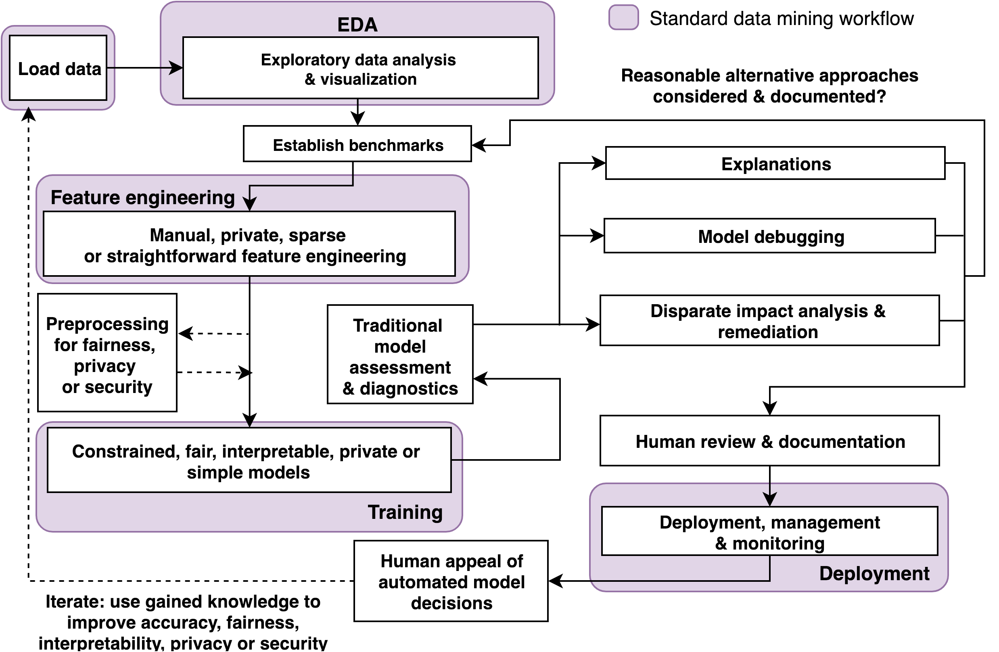

# Toward Human-Centered Machine Learning

_Toward Human-Centered Machine Learning_ presentation from various venues. 

### Potentially Useful Artifacts

* [Slides](main.pdf)
* [Editable Blueprint Draw.io XML](blueprint.xml)
* [Blueprint Image](img/blueprint.png):

### Videos from Talks:

* [H2O World 2019](https://www.youtube.com/watch?v=diMSemHRNDw)
* [Spark AI Summit 2019](https://databricks.com/session/interpretable-ai-not-just-for-regulators)
* BDAEDCON 2019 - Coming Soon
